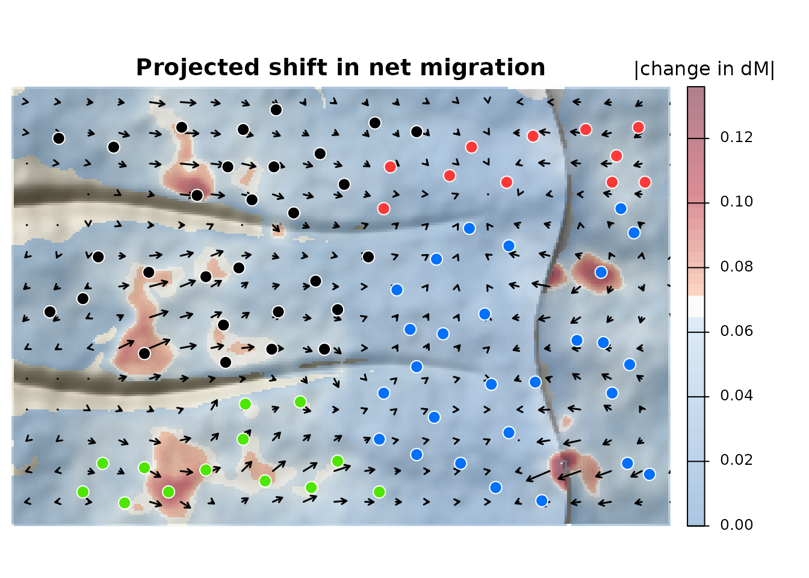

# Getting started with corridoR

corridoR forecasts how genetic connectivity, and the net direction of
migration, shift under climate change, following Maier et al. (2022,
*Heredity*). This short version runs the workflow on part of the
simulated example. The [full
tutorial](https://paulmaier.github.io/corridoR/articles/tutorial.html)
covers every step in detail, including comparing path hypotheses and
choosing a corridor width for each group of features.

``` r

library(corridoR)
library(terra)
library(sf)
ex <- corridor_example(acc = TRUE)
```

The example is a simulated mountain range: 80 snowmelt meadows on a long
western slope that rises to a crest, with a steep escarpment to the east
and two canyons. Migrants favor wetter meadows, and warming dries the
foothills the most.

**1. Genetic distances.** Read genotypes (STRUCTURE, GENEPOP, VCF,
GenAlEx, FSTAT, PLINK, or `adegenet` and `vcfR` objects), then compute
F_(ST) and δM, the net direction of migration:

``` r

pc <- read_genotypes(ex$files$structure)
fst <- pairwise_fst(pc)
dM <- directional_gst(pc)$dM
gen <- pairwise_table(fst, dM)
```

**2. Paths.** Least cost paths between nearby meadows:

``` r

xy <- st_coordinates(ex$sites); rownames(xy) <- ex$sites$site
pairs <- as.data.frame(t(combn(ex$sites$site, 2))); names(pairs) <- c("from", "to")
pairs <- pairs[sqrt(rowSums((xy[pairs$from, ] - xy[pairs$to, ])^2)) < 9000, ]
tr <- make_transition(ex$resistance, barrier = 1e6)
paths <- least_cost_paths(tr, ex$sites, pairs = pairs, dem = ex$dem)
nrow(paths)
#> [1] 291
```

**3. Corridors.** Summarize present and future environment inside each
least cost corridor, weighted by how likely a route through each cell
is:

``` r

both <- c(ex$env, ex$env_future)
names(both) <- c(names(ex$env), paste0(names(ex$env), "_f"))
x <- corridor_extract(both, pairs, acc = ex$acc, q = 0.05, progress = FALSE)
```

**4 and 5. Models.** Each pair is used in both directions, with the
contrast between source and destination meadows and the lineage effect
added. Then a Cubist model of δM:

``` r

vars <- names(ex$env)
now <- both_directions(cbind(x[, c("from", "to", vars)], path_length = paths$length))
future <- now
future[vars] <- both_directions(x[, c("from", "to", paste0(vars, "_f"))])[paste0(vars, "_f")]
now <- cbind(now, site_contrast(ex$sites, now, env = ex$env)[, -(1:2)])
future <- cbind(future, site_contrast(ex$sites, now, env = ex$env_future)[, -(1:2)])
lin <- st_drop_geometry(ex$sites)[, c("site", "lineage")]
now$LineageCross <- future$LineageCross <- lineage_cross(now$from, now$to, lin, ex$lineage_tmrca)
y <- gen$dM[match(paste(now$from, now$to), paste(gen$from, gen$to))]
groups <- list(climate = c("snowpack", "runoff", "summer_temp"),
               climate.at = c("snowpack.at", "runoff.at", "summer_temp.at"))
m <- fit_connectivity(now, y, groups, committees = c(1, 20), neighbors = c(0, 5), folds = 5)
m
#> <corridor_model> Cubist, 20 committees, 5 neighbors
#>   14 features after PCA and VIF filtering; CV RMSE 0.04485, R2 0.485
#>   most important: moisture.at (100), climate.at_PC2 (72), climate.at_PC1 (71), climate.at_PC3 (42), moisture (39)
```

**6. Forecast.** Predict under warming and map the change onto the
corridors:

``` r

change <- data.frame(from = now$from, to = now$to, value = predict(m, future) - predict(m, now))
shift <- map_pairwise(change, ex$acc, ex$sites, progress = FALSE)
lc <- c(North = "#ff3939", East = "#0070ff", West = "#000000", South = "#4ce600")
plot_shift(shift, dem = ex$dem, sites = ex$sites, col_sites = lc[ex$sites$lineage],
           main = "Projected shift in net migration", legend_title = "|change in dM|")
```



Arrows show the net direction of change and red marks where it is
largest: low meadows are pushed upslope toward the crest. With only
nearby pairs this version is coarser than the full tutorial.

## Citation

If you use corridoR, please cite both papers:

Maier PA, Vandergast AG, Ostoja SM, Aguilar A, Bohonak AJ (2022)
Landscape genetics of a sub-alpine toad: climate change predicted to
induce upward range shifts via asymmetrical migration corridors.
*Heredity* 129:257-272. <https://doi.org/10.1038/s41437-022-00561-x>

Maier PA (2027) corridoR: An R package for forecasting genetic range
shifts along migration corridors. *Methods in Ecology and Evolution*, in
review.
