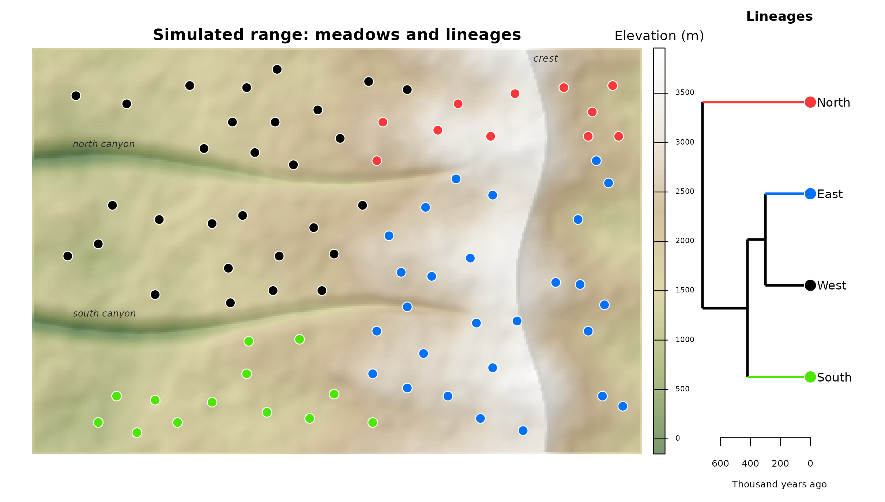
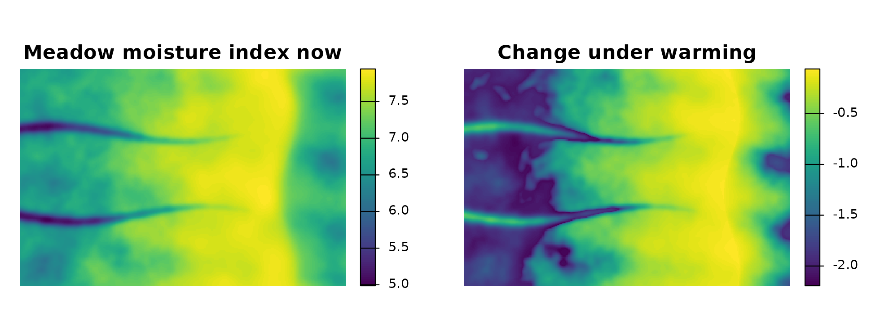
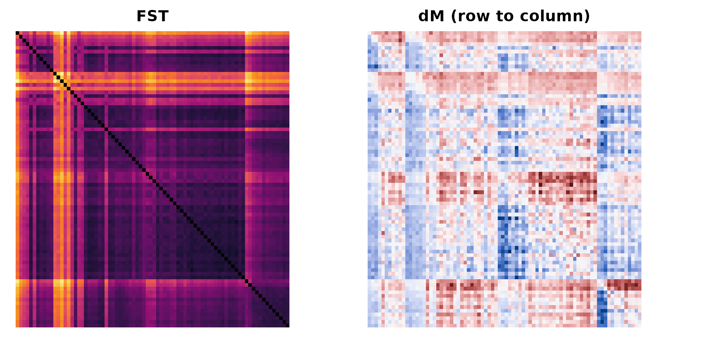
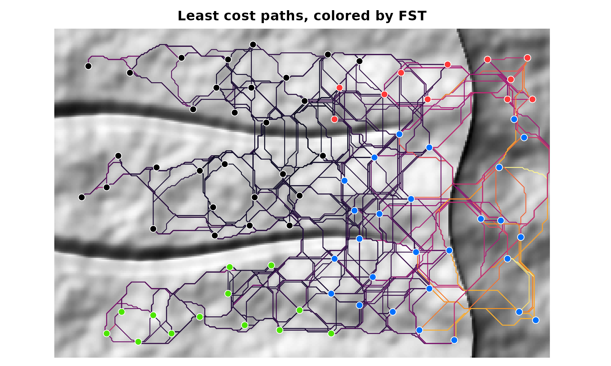
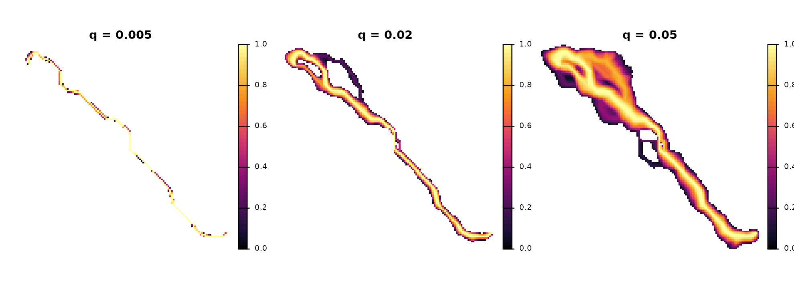
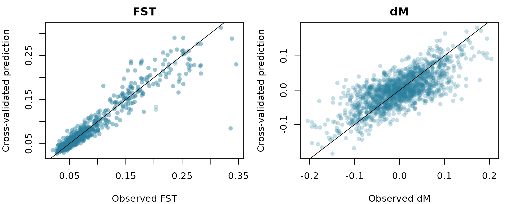
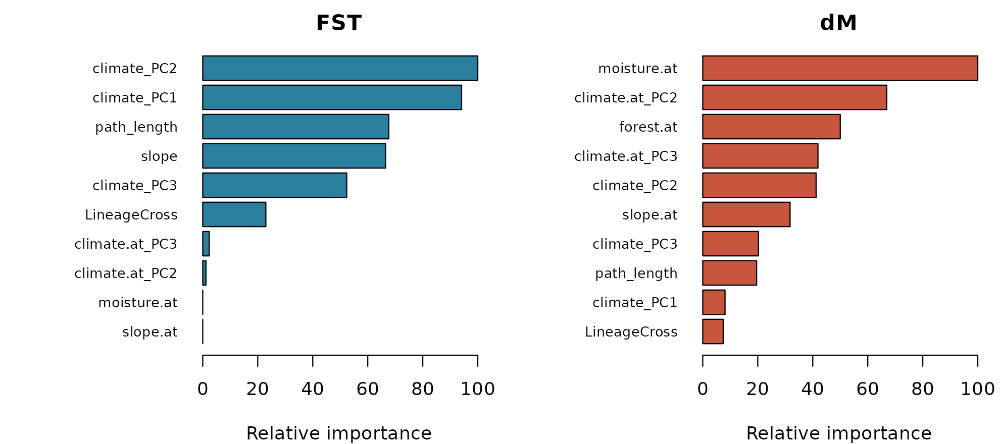
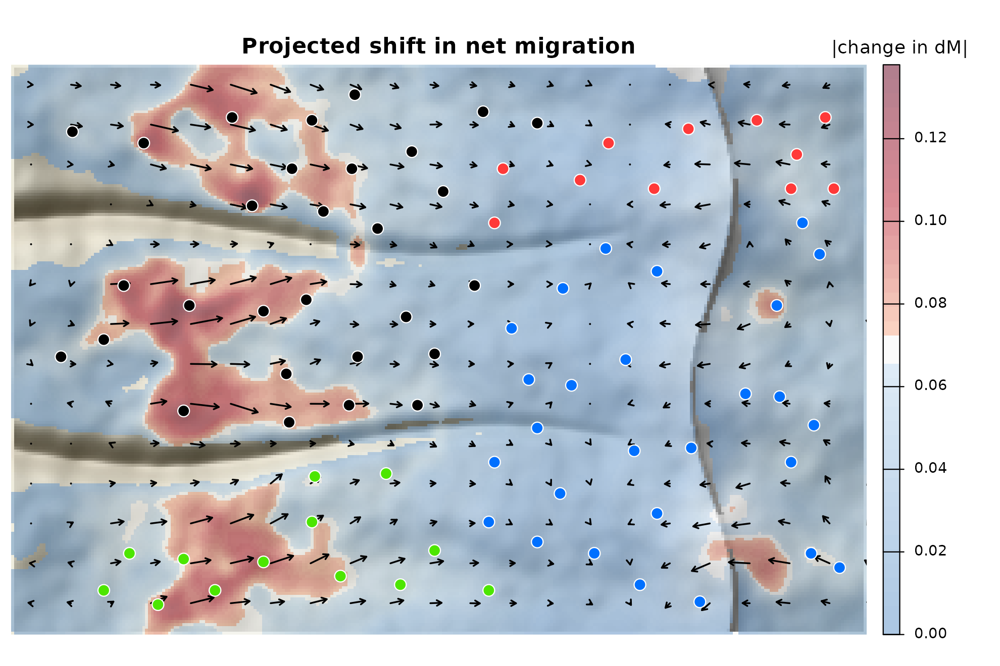
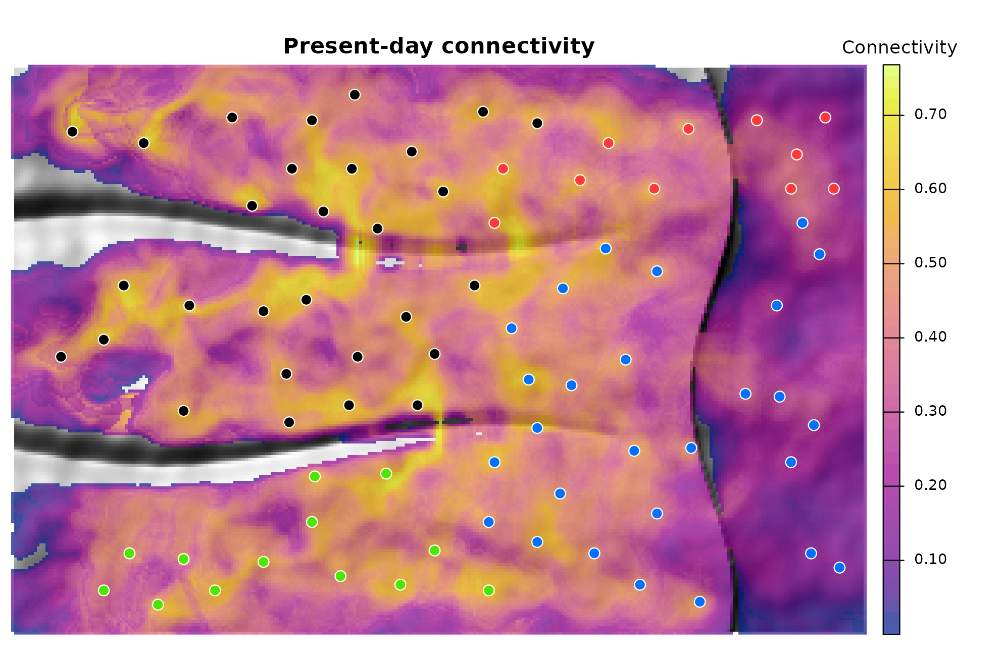

# Full tutorial: from genotypes to a map of genetic range shifts

This tutorial walks through the full corridoR workflow, step by step, on
a simulated mountain range. It follows the six steps of the analysis in
[Maier et al. (2022,
*Heredity*)](https://doi.org/10.1038/s41437-022-00561-x), which forecast
upslope range shifts in the Yosemite toad. The same steps are shown on
the real toad data in the [Yosemite toad
tutorial](https://www.paulmaierresearch.com/software/yosemite-toad-corridors/).
The full run takes about 15 minutes on a laptop; most of that is step 3.

``` r

library(corridoR)
library(terra)
library(sf)
```

## The simulated range

The example range is modeled loosely on the central Sierra Nevada. A
long, gradual western slope rises from foothills at about 1000 m to a
crest above 3400 m near the eastern edge. East of the crest the ground
falls away steeply into a rain shadow. Two river canyons cut the western
slope, with walls steep enough to block movement except near their
heads.

Eighty meadows are sampled, eight snowmelt-dependent toads in each. They
belong to four lineages: West and South at low elevation on either side
of the southern canyon, and North and East at high elevation. Lineages
at the same elevation share their environment but not their history.



The simulation behind the genetic data works like this. Toads move most
easily over gentle, forested ground. Migrants leave a meadow for wetter
neighbors, and the drier their own meadow, the stronger that pull. Under
the warming scenario (+4.2 C), snowpack shrinks by a share that falls
with elevation, from about 90% in the foothills to under 20% at the
crest, as in climate projections for Yosemite. Low meadows dry out the
most, so the push uphill grows most at low elevation. The task is to
recover that pattern from genotypes and landscape data alone.

``` r

ex <- corridor_example(acc = TRUE)
names(ex)
#>  [1] "dem"              "resistance"       "resistance_slope" "resistance_cover"
#>  [5] "lineage_tmrca"    "env"              "env_future"       "sites"           
#>  [9] "files"            "acc"
ex$sites
#> Simple feature collection with 80 features and 3 fields
#> Geometry type: POINT
#> Dimension:     XY
#> Bounding box:  xmin: 3500 ymin: 2100 xmax: 58100 ymax: 37900
#> Projected CRS: +proj=tmerc +lat_0=0 +lon_0=0 +k=1 +x_0=0 +y_0=0 +datum=WGS84 +units=m +no_defs
#> First 10 features:
#>    site elevation lineage                geom
#> 1   M01      1070    West  POINT (3500 19500)
#> 2   M02      1184    West  POINT (4300 35300)
#> 3   M03      1031    West  POINT (6500 20700)
#> 4   M04      1006   South   POINT (6500 3100)
#> 5   M05      1266    West  POINT (7900 24500)
#> 6   M06      1050   South   POINT (8300 5700)
#> 7   M07      1337    West  POINT (9300 34500)
#> 8   M08      1322   South  POINT (10300 2100)
#> 9   M09      1389   South  POINT (12100 5300)
#> 10  M10      1359    West POINT (12100 15700)
```

`ex$env` and `ex$env_future` hold the environmental layers now and under
warming. The change in meadow moisture is largest in the foothills and
fades toward the crest:

``` r

plot(c(ex$env$moisture, ex$env_future$moisture - ex$env$moisture),
     main = c("Meadow moisture index now", "Change under warming"),
     col = hcl.colors(100, "viridis"), axes = FALSE, mar = c(1, 1, 2, 5))
```



## Step 1. Genetic differentiation and the direction of migration

[`read_genotypes()`](https://paulmaier.github.io/corridoR/reference/read_genotypes.md)
reads STRUCTURE, GENEPOP, VCF, GenAlEx, FSTAT and PLINK files and
returns allele counts per population.
[`as_popcounts()`](https://paulmaier.github.io/corridoR/reference/as_popcounts.md)
does the same for `adegenet` and `vcfR` objects. The example ships the
same SNPs in three formats:

``` r

pc <- read_genotypes(ex$files$structure)
pc
#> <popcounts> 80 populations, 1318 loci (2 alleles per locus)
#>   individuals per population: 8-8
#>   populations: M01, M02, M03, M04, M05, M06, M07, M08 ...
pc_vcf <- read_genotypes(ex$files$vcf, pop = ex$files$popmap)   # VCF needs a population map
all.equal(pairwise_fst(pc), pairwise_fst(pc_vcf))
#> [1] TRUE
```

Pairwise F_(ST) measures differentiation. Directional G_(ST) (Sundqvist
et al. 2016, as in `diveRsity::divMigrate`) estimates relative migration
in each direction from a hypothetical gene pool shared by each pair; the
difference, emigration minus immigration, is δM. Positive δM means the
source sends more migrants than it receives.

``` r

fst <- pairwise_fst(pc)
dg <- directional_gst(pc)
gen <- pairwise_table(fst, dg$dM)
head(gen)
#>   from  to        fst           dM
#> 1  M02 M01 0.16311080  0.038685611
#> 2  M03 M01 0.15357827  0.004226984
#> 3  M04 M01 0.23965549  0.011150260
#> 4  M05 M01 0.08890528 -0.088469572
#> 5  M06 M01 0.22114611  0.013136436
#> 6  M07 M01 0.13162280 -0.027356787
```

Ordering the matrices by lineage shows the structure:

``` r

ord <- order(match(ex$sites$lineage, c("North", "East", "West", "South")), ex$sites$elevation)
ids <- ex$sites$site[ord]
op <- par(mfrow = c(1, 2), mar = c(1, 1, 2, 4))
image(t(fst[rev(ids), ids]), axes = FALSE, col = hcl.colors(50, "Inferno"), main = "FST")
lim <- max(abs(dg$dM), na.rm = TRUE)
image(t(dg$dM[rev(ids), ids]), axes = FALSE, zlim = c(-lim, lim),
      col = hcl.colors(50, "Blue-Red 3"), main = "dM (row to column)")
```



``` r

par(op)
```

## Step 2. Choosing the most likely migration paths

Corridors start from a resistance surface, which you supply. In the
paper, `ResistanceGA` optimized the resistance of slope and of
vegetation moisture, and eleven blends of the two were compared. The
example includes both components, so we can do the same.

``` r

xy <- st_coordinates(ex$sites); rownames(xy) <- ex$sites$site
pairs <- as.data.frame(t(combn(ex$sites$site, 2))); names(pairs) <- c("from", "to")
pairs <- pairs[sqrt(rowSums((xy[pairs$from, ] - xy[pairs$to, ])^2)) < 15000, ]
nrow(pairs)
#> [1] 763

blend <- function(w) {
  r <- w * ex$resistance_slope + (1 - w) * ex$resistance_cover
  r[ex$resistance_slope >= 1e6] <- 1e6
  r
}
weights <- seq(0, 1, by = 0.2)
surfaces <- setNames(lapply(weights, blend), paste0("slope_", weights))
```

[`rank_resistance()`](https://paulmaier.github.io/corridoR/reference/rank_resistance.md)
finds the cost of the cheapest route between each pair of meadows
through every surface (ridgelines and canyon walls at resistance 1e6
cannot be crossed) and ranks the surfaces by a mixed model of F_(ST) on
that distance, with source and destination meadow as random effects.
Straight-line distance is added as a baseline.

``` r

rank <- rank_resistance(surfaces, ex$sites, fst, pairs = pairs)
rank
#>      hypothesis   logLik       AIC delta_AIC        R2m       slope
#> 1       slope_1 2288.989 -4567.978   0.00000 0.03622447 0.009864794
#> 2     slope_0.8 2275.221 -4540.442  27.53579 0.05508055 0.011909024
#> 3     slope_0.6 2249.432 -4488.865  79.11340 0.07827913 0.014188459
#> 4     slope_0.4 2214.401 -4418.801 149.17720 0.09825830 0.016025037
#> 5     slope_0.2 2170.227 -4330.453 237.52524 0.10915942 0.017045400
#> 6       slope_0 2121.487 -4232.974 335.00414 0.10355020 0.016687517
#> 7 straight_line 2115.328 -4220.656 347.32251 0.01264270 0.006066638
```

Slope-heavy hypotheses fit best: pure slope ranks first, just ahead of
the 80:20 blend the simulation used, and every path model beats
straight-line distance. We continue with `ex$resistance`, that 80:20
blend, and draw the least cost paths. Path length is measured over the
terrain surface.

``` r

tr <- make_transition(ex$resistance, barrier = 1e6)
paths <- least_cost_paths(tr, ex$sites, pairs = pairs, dem = ex$dem)
paths$fst <- fst[cbind(paths$from, paths$to)]
lc <- c(North = "#ff3939", East = "#0070ff", West = "#000000", South = "#4ce600")
hill <- shade(terrain(ex$dem * 3, "slope", unit = "radians"), terrain(ex$dem, "aspect", unit = "radians"), 35, 315)
plot(hill, col = grey(0:100 / 100), legend = FALSE, axes = FALSE, mar = c(0.5, 0.5, 2, 1),
     main = "Least cost paths, colored by FST")
pc_col <- hcl.colors(50, "Inferno")[cut(paths$fst, 50)]
plot(st_geometry(paths), col = pc_col, lwd = 1.2, add = TRUE)
plot(st_geometry(ex$sites), pch = 21, bg = lc[ex$sites$lineage], col = "white", cex = 1.3, add = TRUE)
```



## Step 3. Corridors and environmental extraction

A toad does not walk a one-pixel line. A least cost corridor keeps the
cheapest share `q` of the landscape between two meadows and weights each
kept cell from 1 on the best route to 0 at the corridor edge:

``` r

w <- lcc_weights(ex$acc, "M20", "M60", q = c(0.005, 0.02, 0.05))
plot(trim(w), col = hcl.colors(50, "Inferno"), axes = FALSE, nc = 3,
     main = c("q = 0.005", "q = 0.02", "q = 0.05"))
```



[`corridor_extract()`](https://paulmaier.github.io/corridoR/reference/corridor_extract.md)
summarizes every environmental layer inside every corridor, weighting
cells by corridor weight; with path buffers it uses the share of each
cell inside the buffer. Present and future layers are extracted
together. We try three bandwidths: a 400 m buffer and two corridor
widths.

``` r

both <- c(ex$env, ex$env_future)
names(both) <- c(names(ex$env), paste0(names(ex$env), "_f"))
bands <- list(
  lcp_400m = corridor_extract(both, pairs, buffers = path_buffers(paths, 400)[[1]], progress = FALSE),
  lcc_0.01 = corridor_extract(both, pairs, acc = ex$acc, q = 0.01, progress = FALSE),
  lcc_0.05 = corridor_extract(both, pairs, acc = ex$acc, q = 0.05, progress = FALSE)
)
head(bands$lcc_0.05[, 1:6])
#>   from  to snowpack   runoff moisture summer_temp
#> 1  M01 M03 404.5949 303.7365 6.580613    26.32584
#> 2  M01 M05 448.9926 327.0718 6.666222    25.87754
#> 3  M01 M06 650.3694 442.9360 6.954292    23.25507
#> 4  M01 M10 463.5224 330.3576 6.692418    25.43482
#> 5  M01 M11 471.0468 337.0674 6.706028    25.53177
#> 6  M01 M16 544.0001 379.0492 6.822005    24.72180
```

## Step 4. A bandwidth for each group of features

Climate may act over a broad swath of landscape, while slope matters
right along the route.
[`select_bandwidth()`](https://paulmaier.github.io/corridoR/reference/select_bandwidth.md)
fits a random forest of F_(ST) on each feature group under each
bandwidth and keeps the one with the lowest cross-validated error.

``` r

groups <- list(climate = c("snowpack", "runoff", "summer_temp"), wetness = "moisture",
               terrain = "slope", cover = "forest")
sel <- select_bandwidth(bands, fst[cbind(pairs$from, pairs$to)], groups, num.trees = 300)
sel
#>      group bandwidth mtry min.node.size       RMSE   Rsquared
#> 1  climate  lcp_400m    1             5 0.02672350 0.78889059
#> 2  climate  lcc_0.05    2            10 0.02834149 0.75915926
#> 3  climate  lcc_0.01    2            10 0.02929042 0.74315211
#> 4    cover  lcc_0.05    1            10 0.05683060 0.13809218
#> 5    cover  lcp_400m    1            10 0.05761762 0.10563157
#> 6    cover  lcc_0.01    1            10 0.05814010 0.08152276
#> 7  terrain  lcc_0.05    1            10 0.04135029 0.50222774
#> 8  terrain  lcc_0.01    1            10 0.05159779 0.25553573
#> 9  terrain  lcp_400m    1            10 0.05387279 0.20111673
#> 10 wetness  lcp_400m    1            10 0.05490923 0.16303562
#> 11 wetness  lcc_0.05    1            10 0.05598479 0.15127696
#> 12 wetness  lcc_0.01    1            10 0.05741756 0.12744798
best <- attr(sel, "best")
best
#>    climate      cover    terrain    wetness 
#> "lcp_400m" "lcc_0.05" "lcc_0.05" "lcp_400m"
```

## Step 5. Models of F_(ST) and δM

The model data hold one row per *directed* pair. Corridor features are
the same in both directions, so
[`both_directions()`](https://paulmaier.github.io/corridoR/reference/both_directions.md)
repeats them.
[`site_contrast()`](https://paulmaier.github.io/corridoR/reference/site_contrast.md)
adds at-site features: the difference between the source and destination
meadow. Path length and the lineage effect
([`lineage_cross()`](https://paulmaier.github.io/corridoR/reference/lineage_cross.md):
time since two lineages split, zero within a lineage) go in as they are.

``` r

pick <- function(suffix = "") {
  out <- pairs
  for (g in names(groups)) out[groups[[g]]] <- bands[[best[[g]]]][paste0(groups[[g]], suffix)]
  out$path_length <- paths$length
  both_directions(out)
}
now <- pick(); future <- pick("_f")
now <- cbind(now, site_contrast(ex$sites, now, env = ex$env)[, -(1:2)])
future <- cbind(future, site_contrast(ex$sites, now, env = ex$env_future)[, -(1:2)])
lin <- st_drop_geometry(ex$sites)[, c("site", "lineage")]
now$LineageCross <- future$LineageCross <- lineage_cross(now$from, now$to, lin, ex$lineage_tmrca)
y <- gen[match(paste(now$from, now$to), paste(gen$from, gen$to)), ]
model_groups <- c(groups, list(climate.at = paste0(groups$climate, ".at")))
```

[`fit_connectivity()`](https://paulmaier.github.io/corridoR/reference/fit_connectivity.md)
runs a PCA within each feature group, tunes a Cubist model (rule-based
trees with a linear model in every leaf, which extrapolate better than
random forests), drops collinear features by importance, and refits.

``` r

m_fst <- fit_connectivity(now, y$fst, model_groups, committees = c(1, 10, 50), neighbors = c(0, 5))
m_dm <- fit_connectivity(now, y$dM, model_groups, committees = c(1, 10, 50), neighbors = c(0, 5))
m_fst
#> <corridor_model> Cubist, 50 committees, 5 neighbors
#>   12 features after PCA and VIF filtering; CV RMSE 0.01811, R2 0.902
#>   most important: climate_PC2 (100), climate_PC1 (94), path_length (68), slope (66), climate_PC3 (52)
m_dm
#> <corridor_model> Cubist, 10 committees, 5 neighbors
#>   12 features after PCA and VIF filtering; CV RMSE 0.04336, R2 0.532
#>   most important: moisture.at (100), climate.at_PC2 (76), climate_PC2 (59), climate.at_PC1 (57), forest.at (55)
```

``` r

op <- par(mfrow = c(1, 2), mar = c(4, 4, 2, 1))
plot(m_fst$observed, m_fst$cv_pred, pch = 16, col = "#2a7f9e44", xlab = "Observed FST",
     ylab = "Cross-validated prediction", main = "FST"); abline(0, 1)
plot(m_dm$observed, m_dm$cv_pred, pch = 16, col = "#2a7f9e44", xlab = "Observed dM",
     ylab = "Cross-validated prediction", main = "dM"); abline(0, 1)
```



``` r

par(op)
```

F_(ST) is explained mostly by corridor features and path length, δM
mostly by contrasts between meadows, as in the Yosemite toad:

``` r

op <- par(mfrow = c(1, 2), mar = c(4, 9, 2, 1))
barplot(rev(head(m_fst$importance, 10)), horiz = TRUE, las = 1, cex.names = 0.75,
        col = "#2a7f9e", main = "FST", xlab = "Relative importance")
barplot(rev(head(m_dm$importance, 10)), horiz = TRUE, las = 1, cex.names = 0.75,
        col = "#c8553d", main = "dM", xlab = "Relative importance")
```



``` r

par(op)
```

## Step 6. Forecasting under climate change

[`predict()`](https://rspatial.github.io/terra/reference/predict.html)
projects future climate onto the present-day PCA loadings and predicts
each pair now and under warming.

``` r

change <- data.frame(from = now$from, to = now$to,
                     fst = predict(m_fst, future) - predict(m_fst, now),
                     dM = predict(m_dm, future) - predict(m_dm, now))
summary(change[, c("fst", "dM")])
#>       fst                  dM            
#>  Min.   :-0.224821   Min.   :-0.3607034  
#>  1st Qu.:-0.008467   1st Qu.:-0.0462446  
#>  Median : 0.031226   Median : 0.0003446  
#>  Mean   : 0.024150   Mean   : 0.0030933  
#>  3rd Qu.: 0.054055   3rd Qu.: 0.0455147  
#>  Max.   : 0.216369   Max.   : 0.4056813
```

[`map_pairwise()`](https://paulmaier.github.io/corridoR/reference/map_pairwise.md)
spreads each pair’s change over its corridor and averages overlapping
corridors. For δM it also sums direction vectors, each pointing from
source to destination and weighted by the size of the change, to give a
net direction in every cell.
[`plot_shift()`](https://paulmaier.github.io/corridoR/reference/plot_shift.md)
draws the result: blue where change is small, red where it is large.

``` r

shift <- map_pairwise(data.frame(change[, 1:2], value = change$dM), ex$acc, ex$sites, progress = FALSE)
plot_shift(shift, dem = ex$dem, sites = ex$sites, col_sites = lc[ex$sites$lineage],
           main = "Projected shift in net migration", legend_title = "|change in dM|")
```



The pressure falls on the lowest meadows. On both sides of each canyon,
long arrows run east, upslope, from the foothills; they shorten through
the middle elevations and all but vanish near the crest, the refuge.
East of the crest the arrows turn and climb back west up the escarpment.
The canyons stand out as gaps that corridors cannot cross. This is the
pattern built into the simulation, recovered from genotypes and
landscape data.

The F_(ST) model maps present-day connectivity the same way. Scaling
predicted F_(ST) so that 1 is the best-connected pair, and averaging
over corridors, shows corridors of high flow and the pinch points
between them:

``` r

fst_now <- predict(m_fst, now)
conn <- data.frame(from = now$from, to = now$to, value = (max(fst_now) - fst_now) / diff(range(fst_now)))
conn_map <- map_pairwise(conn, ex$acc, ex$sites, direction = FALSE, absolute = FALSE, progress = FALSE)
plot(hill, col = grey(0:100 / 100), legend = FALSE, axes = FALSE, mar = c(0.5, 0.5, 2, 6),
     main = "Present-day connectivity")
plot(conn_map$value, col = hcl.colors(50, "Plasma"), alpha = 0.7, add = TRUE,
     plg = list(title = "Connectivity"))
plot(st_geometry(ex$sites), pch = 21, bg = lc[ex$sites$lineage], col = "white", cex = 1.3, add = TRUE)
```



## Using your own data

- **Genotypes:** any format
  [`read_genotypes()`](https://paulmaier.github.io/corridoR/reference/read_genotypes.md)
  reads, or matrices of F_(ST) and δM from other software.
- **Sites:** an `sf` layer of points or polygons whose ID column matches
  the population names.
- **Resistance:** a raster per hypothesis, built by hand from layers
  such as slope or vegetation, or optimized with `ResistanceGA`;
  [`rank_resistance()`](https://paulmaier.github.io/corridoR/reference/rank_resistance.md)
  compares them as in step 2.
- **Environment:** any stack of rasters, with future versions under the
  same layer names.
- **Lineages:** a table of site lineages and a table of divergence times
  for
  [`lineage_cross()`](https://paulmaier.github.io/corridoR/reference/lineage_cross.md).
- **Scale:**
  [`accumulated_cost()`](https://paulmaier.github.io/corridoR/reference/accumulated_cost.md)
  can write to disk, and corridors are built one pair at a time, so
  large landscapes need time rather than memory.

## Citation

If you use corridoR, please cite both papers:

Maier PA, Vandergast AG, Ostoja SM, Aguilar A, Bohonak AJ (2022)
Landscape genetics of a sub-alpine toad: climate change predicted to
induce upward range shifts via asymmetrical migration corridors.
*Heredity* 129:257-272. <https://doi.org/10.1038/s41437-022-00561-x>

Maier PA (2027) corridoR: An R package for forecasting genetic range
shifts along migration corridors. *Methods in Ecology and Evolution*, in
review.

## Other references

Sundqvist L, Keenan K, Zackrisson M, Prodohl P, Kleinhans D (2016)
Directional genetic differentiation and relative migration. *Ecology and
Evolution* 6:3461-3475.
